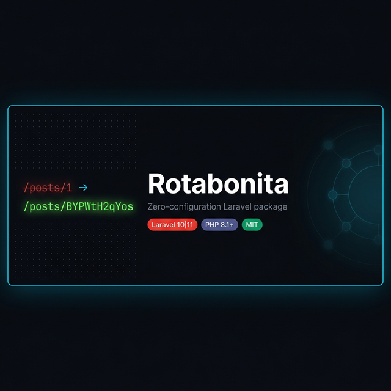

<p align="center">
  
</p>

# Rotabonita

> Install the package. That's it. Your Laravel routes go from `/posts/1` to `/posts/BYPWtH2qYos` — automatically, with zero configuration, zero traits, zero model changes.

**Rotabonita** is a Laravel 10/11 package that automatically replaces numeric database IDs in your URLs with short, secure, URL-safe public tokens — the same 11-character format YouTube uses for video URLs (e.g. `BYPWtH2qYos`).

It works by intercepting Laravel internally at three points:
- **Token generation** — assigns a unique `public_id` to every new Eloquent model record automatically
- **URL generation** — `route('posts.show', $post)` produces `/posts/BYPWtH2qYos` instead of `/posts/1`
- **Route resolution** — resolves `/posts/BYPWtH2qYos` back to the correct model via `WHERE public_id = ?`

**No traits. No model changes. No config publishing. No manual route edits. Just install.**

[](https://packagist.org/packages/arnaldo-tomo/rotabonita)
[](LICENSE)
[](https://php.net)
[](https://laravel.com)

> 📖 [Documentação em Português](README.pt.md)

---

## Installation

```bash
composer require arnaldo-tomo/rotabonita
```

Publish and configure the migration for each table you want to protect:

```bash
php artisan vendor:publish --tag=rotabonita-migrations
```

Open the published file in `database/migrations/` and set your table name:

```php
protected string $table = 'posts'; // ← change this
```

Run the migration:

```bash
php artisan migrate
```

**That's it. No further configuration required.**

---

## What changes

**Before** installing Rotabonita:
```
GET  /posts/1
GET  /posts/2
GET  /users/47
```

**After** installing Rotabonita:
```
GET  /posts/BYPWtH2qYos
GET  /posts/K9mXpL2rTnQ
GET  /users/w4RvNcJ8ZoM
```

Your code stays **exactly the same**. Models, routes, controllers, Blade templates — nothing changes.

---

## How it works

Rotabonita intercepts Laravel in three places automatically:

**1 — On model creation**
```php
Post::create(['title' => 'Hello']); // → public_id = 'BYPWtH2qYos' auto-assigned
```

**2 — On URL generation**
```php
route('posts.show', $post); // → /posts/BYPWtH2qYos  (not /posts/1)
```

**3 — On route resolution**
```
GET /posts/BYPWtH2qYos → SELECT * FROM posts WHERE public_id = 'BYPWtH2qYos'
GET /posts/1           → SELECT * FROM posts WHERE id = 1  (fallback)
```

If no record is found → HTTP 404, same as default Laravel behaviour.

---

## Your code does not change

```php
// Model — unchanged
class Post extends Model
{
    protected $fillable = ['title'];
}

// Route — unchanged
Route::resource('posts', PostController::class);

// Controller — unchanged
public function show(Post $post): View
{
    return view('posts.show', compact('post'));
}

// Blade — unchanged, but now generates the token URL
route('posts.show', $post) // → /posts/BYPWtH2qYos ✅
```

---

## Token format

| Property | Value |
|---|---|
| Length | 11 characters |
| Alphabet | `A–Z a–z 0–9 _ -` (64 symbols) |
| Total combinations | 64¹¹ ≈ **73 quintillion** |
| Entropy source | `random_bytes()` — cryptographically secure |
| Uniqueness | Verified against the database before saving |
| Collision guard | Retries up to 10× on the (near-impossible) collision |

---

## Backfilling existing records

If you added `public_id` to a table that already has rows:

```bash
php artisan tinker
```

```php
$gen = app(\Rotabonita\TokenGenerator::class);

App\Models\Post::whereNull('public_id')->each(function ($post) use ($gen) {
    $post->public_id = $gen->generateUnique($post);
    $post->saveQuietly();
});
```

---

## Advanced: models outside app/Models/

If your models live in a non-standard directory, register them manually:

```php
// AppServiceProvider::register()
$this->app->bind('rotabonita.models', fn() => [
    \App\Domain\Blog\Post::class,
    \App\Domain\Commerce\Product::class,
]);
```

---

## Compatibility

| Laravel | PHP  | Status |
|---------|------|--------|
| 10.x    | 8.1+ | ✅ Supported |
| 11.x    | 8.2+ | ✅ Supported |

---

## License

MIT © [Arnaldo Tomo](https://github.com/arnaldo-tomo)
